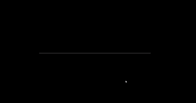

# Partial Differential Equation (Approximate Solutions to the Wave Equation) 
_Note: running this script requires SFML 2.6.1 to be linked_

## Overview
Modify the code to set the initial conditions and then iterate through the time steps to see the evolution of the approximate solution. The code certainly isn't perfect, but it was a means for me to start learning C++ in high school _and is no longer reflective of my current C++ proficiency_.

## List of Controllable Settings:
- Position of the curve: `mouse1`/`mouse2`
  * Click `mouse1` to center the graph at the pointer's current position
- Time: `up_arrow`/`down_arrow`
  * You can roll time forwards/backwards by holding `up_arrow`/`down_arrow`
- Zoom: `right_arrow`/`left_arrow`
  * You can zoom in/out by holding `right_arrow`/`left_arrow`

## Video Example

